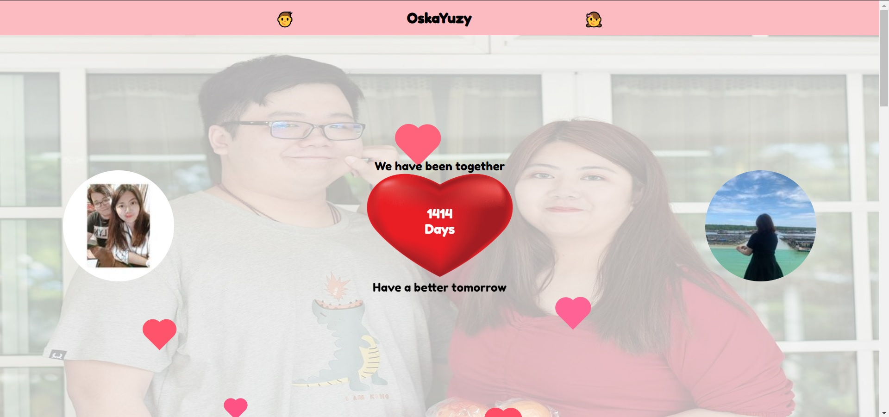

# oskayuzy

personal couple site just to record down the thing between us

# Development

With github actions, every night will run a script to get data from instagram, and pump into `gist`. You can see the script at `index.js` and `action.yml` for workflow setting. For frontend it's using `react` & `vitejs` to do development.

# Build

For github actions script have to build with `@vercel/ncc` before push, frontend also have to build before push. Since my github pages is set to `master` branch so it take from `docs/` folder in `master` branch. In `public/` folder having `CNAME` it's for custom domain setting ifn't the original setting will be overrided.

# Make your own

1. Update setting in `assets/setting.json`.
2. Run `yarn build` to build with new setting.
3. Rename title in `index.html` with your preferred title name.
4. Update images with yours in `assets/images/` folder.
5. Update repository name in `.github/workflows/schedule.yml`. 
6. Add `GH_TOKEN` with your github token for updating `gist`.
7. Add `IG_USERNAME` and `IG_PASSWORD` with your gallery ig username and password for login instagram account and retrieve posts.
8. Push to repository.
9. Trigger the actions to fetch data from instagram.
10. Here you go.

# Reference

| Component        | Source                                                                |
| ---------------- | --------------------------------------------------------------------- |
| Psyduck          | https://codepen.io/tiffachoo/pen/abdLKaP                              |
| Lion             | https://codepen.io/thepandalion/pen/gjske                             |
| Love Effect      | https://codepen.io/vivinantony/pen/gbENBB                             |
| Instagram Images | https://reactjsexample.com/3d-cover-flow-in-react/                    |
| Carousel         | react-responsive-carousel                                             |
| Slideshow        | https://css-tricks.com/snippets/jquery/simple-auto-playing-slideshow/ |
| Heartbeat        | https://codepen.io/fivera/pen/rzepn                                   |
| Loader           | https://loading.io/css/                                               |
| Font             | GoogleFonts - Fredoka One                                             |
| InstagramAPI     | https://github.com/dilame/instagram-private-api                       |

# View

| Platform | View                           |
| -------- | ------------------------------ |
| Desktop  |  |
| Mobile   |    |